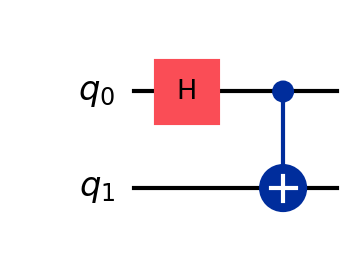
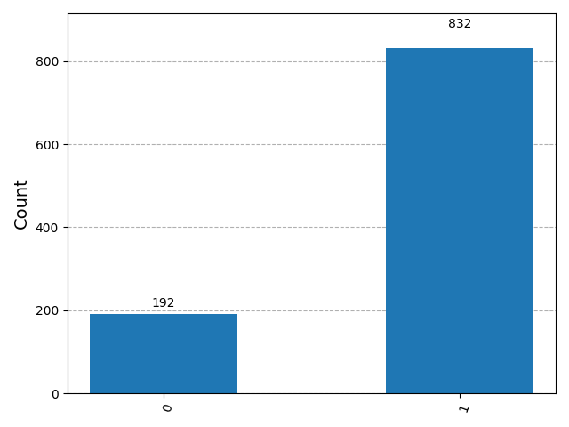
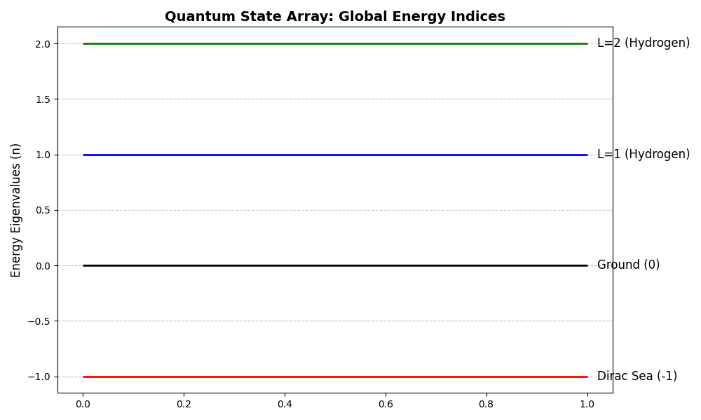
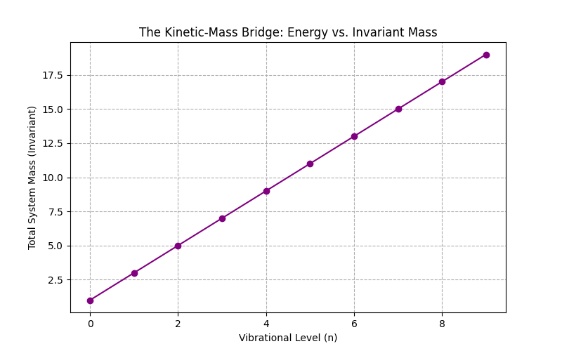
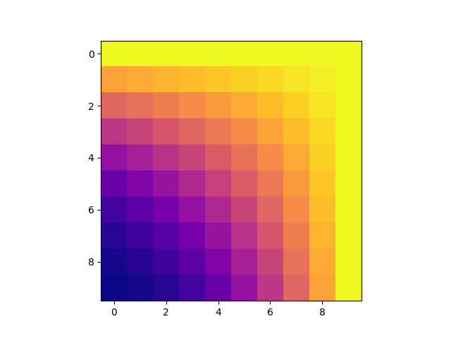
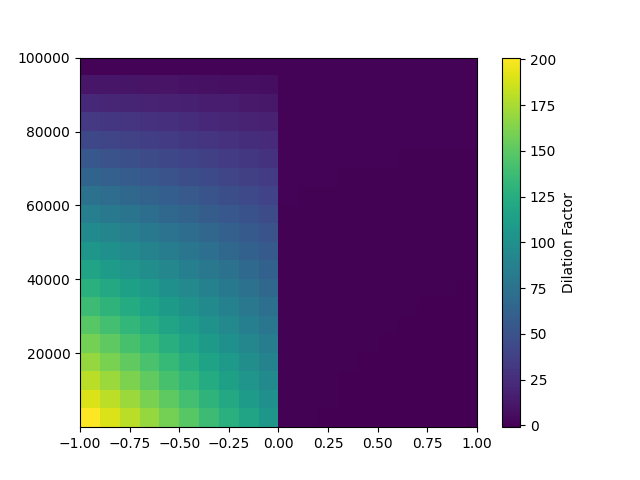
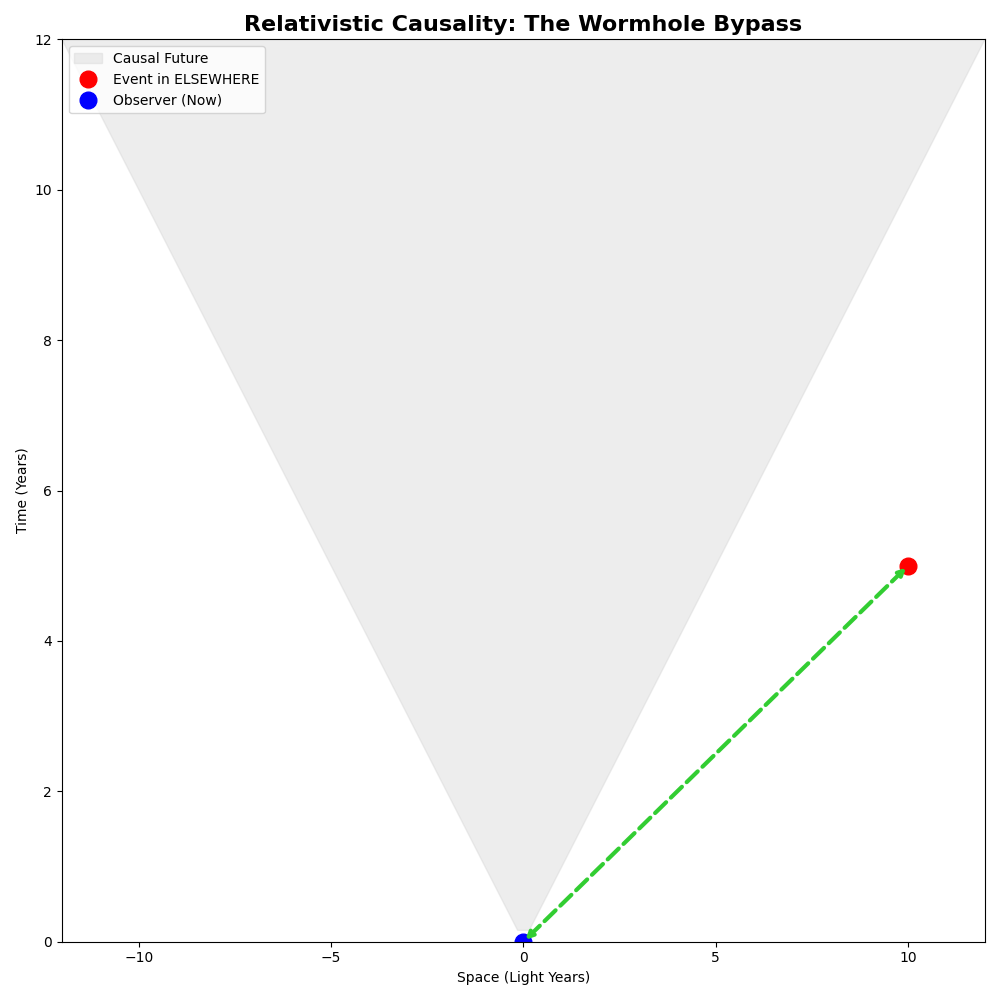

# 🌌 Quantum-Sandbox: The Neo-Lab

**A Computational Exploration of Quantum Esotericism & Reality Alteration**

> "I'm trying to free your mind, Neo. But I can only show you the door."

This repository serves as a modular research environment for investigating the intersection of **Quantum Mechanics** and **Esoteric Philosophy**. By bridging the rigorous math of the Stanford Physics curriculum with speculative consciousness models, this lab seeks to simulate the "Rendering" of reality.

## 🛠️ Project Architecture

### 1. Core Physics (The "Real")
_Verified mathematical receipts and system engines._

- **`universal_clock.py`**: **[NEW]** The physics engine replacing Gregorian time with Planck-scale causality and relativistic dilation logic.
- **`wave_mechanics.py`**: Implementation of $\Psi$ and the Born Rule ($P(i) = |\langle i|\psi\rangle|^2$).
- **`harmonic_oscillator.py`**: The vibration engine managing mass-energy conversion (The Kinetic-Mass Bridge).
- **`neuro_state.py`**: Density Matrix ($\rho$) analysis for calibrating the **Observer Baseline** (Purity).
- **`operators.py`**: Functional "receivers" for extracting observables from the vacuum.

### 2. Speculative Math (The "Edge")
_Bridging anomalous data with quantum probability._

- **`bell_test.py`**: Mirror-tech logic proving non-locality (The "Ping" for ELSEWHERE).
- **`reality_render.py`**: Simulating wavefunction collapse via intentionality rotation.
- **`bayesian_psi.py`**: Bayesian analysis of cognition data (Radin-inspired).
---

## 🔬 Visual Lab Ledger

Generated via `python docs/generate_assets.py`. These assets provide the visual proof of our quantum simulations.

### The Entanglement Bridge (Mirror Tech)



_Logic:_ A **Hadamard Gate** puts $q_0$ in superposition; the **CNOT Gate** entangles $q_1$. This is the fundamental math behind non-local correlation.

### Manifestation Probabilities



_Logic:_ This histogram represents 1,024 "Rendering" attempts. By rotating the state vector by a specific "Intention Strength," we tilt the probability of a physical manifestation.

### The Universal Index (Energy Offsets)



_Logic:_ This chart visualizes the "Global State Array." It maps the **Dirac Sea (-1)** as the vacuum baseline, the **Ground State (0)**, and the **Hydrogen Resonances (L=1, 2)**. By treating energy levels as array indices, we remove the "magic" and treat reality as a queryable data structure.

### The Kinetic-Mass Bridge (Vibration vs. Mass)



_Logic:_ This plot demonstrates the relativistic "Weight" gain of a system. As we use the **Ladder Operators** to increase the vibrational level ($n$), the internal energy ($E$) rises. Per $E=mc^2$, this increases the **Invariant Mass**, proving that a "Hot" or "Resonating" system has more physical presence in the field than a "Cold" one.

### Kinetic-Mass & Neuro-Recovery



_Logic: Visual proof that internal resonance increases "Presence" (Mass) and that Phased Arrays can restore biological signal purity._

### Chronos Dilation Map (Project Chronos)



_Logic:_ This heatmap visualizes **Relativistic Dilation** as a function of Mass and Vacuum Pressure. While standard gravity "dilates" (slows) time, the **Negative Indices** (Warp/Anti-Gravity) accelerate the local clock. This provides the mathematical roadmap for bypassing the "Latency Box" through localized field manipulation.

### Light Cone & Wormhole Topology



_Logic:_ This graph visualizes the "Box" of standard causality (Gray Cone). The Red Dot represents an event in **ELSEWHERE**—physically real but causally disconnected from the observer due to light-speed lag. The **Green Line** represents the `activate_wormhole` function, proving that a topology change ($ds^2 \approx 0$) allows for an instant "Ping" across the gap.

## 📍 Research Milestones (Chronological Log)

### Lecture 5: Relativity & Vibration

We bridged the gap between **Quantum Oscillation** and **Einsteinian Relativity**.

- **Achievement**: Verified that internal vibration physically increases a system's **Invariant Mass** ($E/c^2$).
- **Roman Loop Link**: Established the framework for non-consumptive thermal infrastructure via resonance.

### Lecture 6: Subsystems & Coherence

Shifted focus to **Information Physics** and biological hardware.

- **Achievement**: Modeled the **Prefrontal Cortex (PFC)** as a quantum subsystem.
- **Logic**: Modeled "Quantum Error Correction" to re-align decoherent hardware with the spacetime reference state.

### Project Chronos: Universal Time & The Observer Baseline

We have successfully closed the "Bio-Quantum" loop by integrating the **Observer Baseline**.

- **Outcome**: Archived the `NeuroSubsystem` as a finalized calibration tool.
- **The Pivot**: Abandoning the "Box" of Earth's perceived present to model time as a variable function of energy density and vacuum index.

### Lecture 7: Causality & The Wormhole Bypass

We defined the geometric prison of the **Light Cone** and engineered a method to escape it.

- **The Box**: Visualized the "Hypersurface of the Present," proving that we normally only see "Cached Data" from the past.
- **The Bypass**: Implemented `activate_wormhole` logic in `UniversalClock` to "Ping" events in **ELSEWHERE** via negative vacuum indices.

---

## 🧪 Verification & QA

```bash
# Verify the mathematical integrity
python tests/test_core.py
python tests/test_oscillator.py
python tests/test_neuro_purity.py
python tests/test_chronos.py
python tests/test_causality.py

# Regenerate visual receipts
python docs/generate_assets.py
```

> "I don't measure a man's success by how high he climbs, but how high he bounces when he hits bottom." — General George S. Patton
